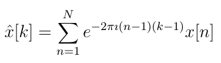
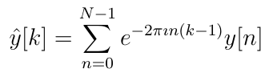

# FFTViews

[](https://travis-ci.org/timholy/FFTViews.jl)

[](http://codecov.io/github/timholy/FFTViews.jl?branch=master)

A package for simplifying operations that involve fourier
transforms. An FFTView of an array uses periodic boundary conditions
for indexing, and shifts all indices of the array downward by 1.

# Usage

Let's create a random signal:
```julia


julia> using FFTViews

julia> a = rand(8)
8-element Array{Float64,1}:
 0.720657
 0.42337
 0.207867
 0.959567
 0.371366
 0.907781
 0.852526
 0.689934
```

Now let's take its Fourier transform, and wrap the result as an `FFTView`:
```julia
julia> afft = fft(a)
8-element Array{Complex{Float64},1}:
   5.13307+0.0im
 -0.183898+0.796529im
   0.03163+0.31835im
   0.88248-0.492787im
 -0.828236+0.0im
   0.88248+0.492787im
   0.03163-0.31835im
 -0.183898-0.796529im

julia> v = FFTView(afft)
FFTViews.FFTView{Complex{Float64},1,Array{Complex{Float64},1}} with indices FFTViews.URange(0,7):
   5.13307+0.0im
 -0.183898+0.796529im
   0.03163+0.31835im
   0.88248-0.492787im
 -0.828236+0.0im
   0.88248+0.492787im
   0.03163-0.31835im
 -0.183898-0.796529im
```

Now we can easily look at the zero-frequency bin:
```julia
julia> v[0]
5.133068739504999 + 0.0im

julia> sum(a)
5.133068739504998
```
or negative as well as positive frequencies:
```julia
julia> v[-4:3]
8-element Array{Complex{Float64},1}:
 -0.828236+0.0im
   0.88248+0.492787im
   0.03163-0.31835im
 -0.183898-0.796529im
   5.13307+0.0im
 -0.183898+0.796529im
   0.03163+0.31835im
   0.88248-0.492787im
```

Perhaps even more interestingly, one can also simplify the process of
convolution. Let's create a "delta-function" signal:
```julia
julia> b = zeros(8); b[3] = 1; b  # the signal
8-element Array{Float64,1}:
 0.0
 0.0
 1.0
 0.0
 0.0
 0.0
 0.0
 0.0
```
and then create the kernel using an `FFTView`:

```julia
julia> kernel = FFTView(zeros(8))
FFTViews.FFTView{Float64,1,Array{Float64,1}} with indices FFTViews.URange(0,7):
 0.0
 0.0
 0.0
 0.0
 0.0
 0.0
 0.0
 0.0

julia> kernel[-1:1] = rand(3)
3-element Array{Float64,1}:
 0.16202
 0.446872
 0.649135

julia> kernel
FFTViews.FFTView{Float64,1,Array{Float64,1}} with indices FFTViews.URange(0,7):
 0.446872
 0.649135
 0.0
 0.0
 0.0
 0.0
 0.0
 0.16202
```

Now compute the convolution via the FFT:
```julia
julia> real(ifft(fft(b).*fft(kernel)))
8-element Array{Float64,1}:
  0.0
  0.16202
  0.446872
  0.649135
  0.0
 -5.55112e-17
  0.0
 -6.93889e-17
```
or alternatively
```julia
julia> irfft(rfft(b).*rfft(kernel),8)
8-element Array{Float64,1}:
  0.0
  0.16202
  0.446872
  0.649135
  0.0
 -2.77556e-17
  0.0
 -5.55112e-17
```
This simplifies the process of remembering how to pack your kernel.

## Caution: FFTViews are not composable

In Julia, almost all other view types are composable: you can make a
`ReshapedArray` of a `SubArray` of a `StaticArray` of a .... In
contrast, `FFTViews` are *not safe* when placed inside other
containers. The reason is that the `*fft` methods are specialized for
`FFTViews`, and strip off the outer container; this does not happen if
you wrap an `FFTView` inside of some other array type.  If you do wrap
`FFTViews`, you might see strange off-by-1 bugs due to the FFTView
translating the indices.

Another way of saying the same thing is the following: for a general vector `x`, its FFT is defined as



Here `x[n]` is defined with periodic boundary conditions, so that if the indices of `x` are not naturally from 1 to N, this formula still holds.

However, if `y = FFTView(x)`, then in terms of `y` we have



which is shifted by 1. Since `FFTView`s use a different definition of
the FFT compared to all other array types, they need to be used with
caution. It's recommended that the FFTView wrapper be applied only for
the process of setting up or analyzing the result of the transform;
for all other operations, pass the `parent` array (obtainable from
`parent(y)` or just by reference to `x` itself).
